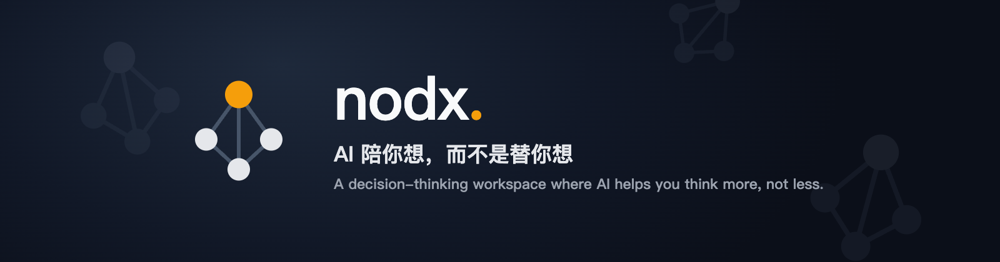
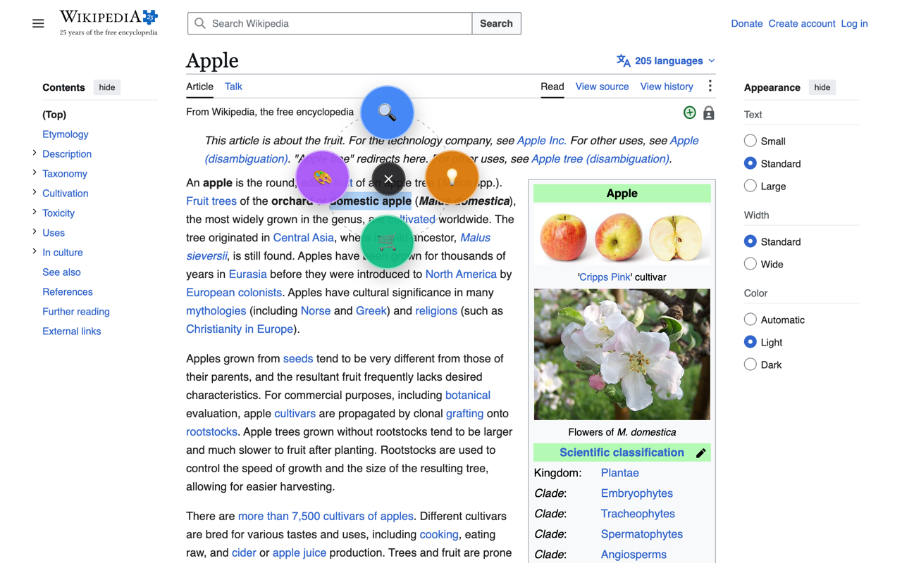
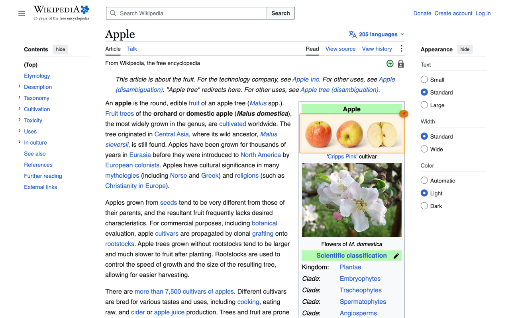
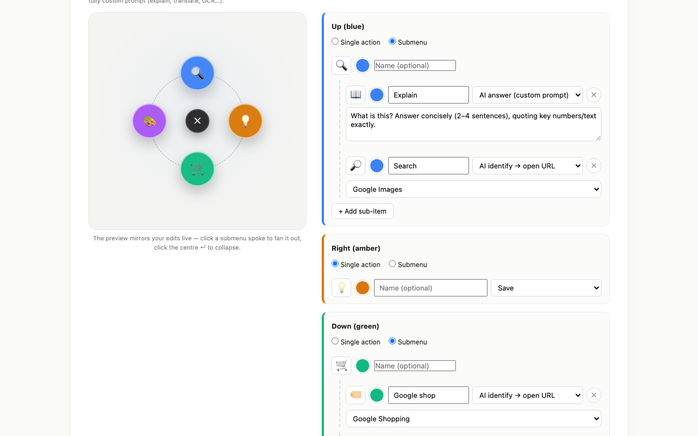
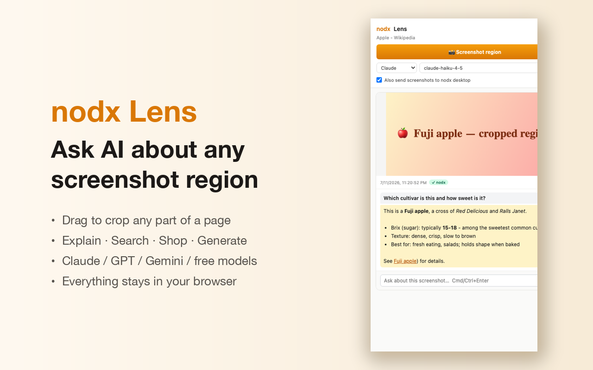
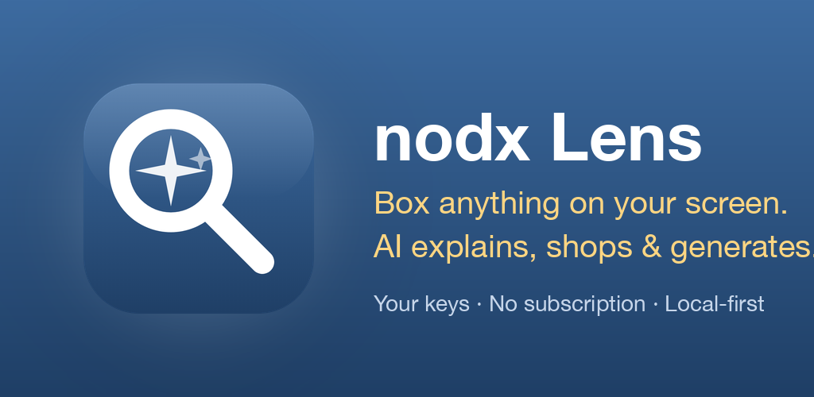
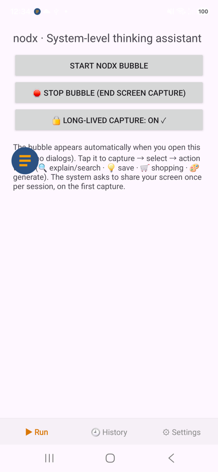
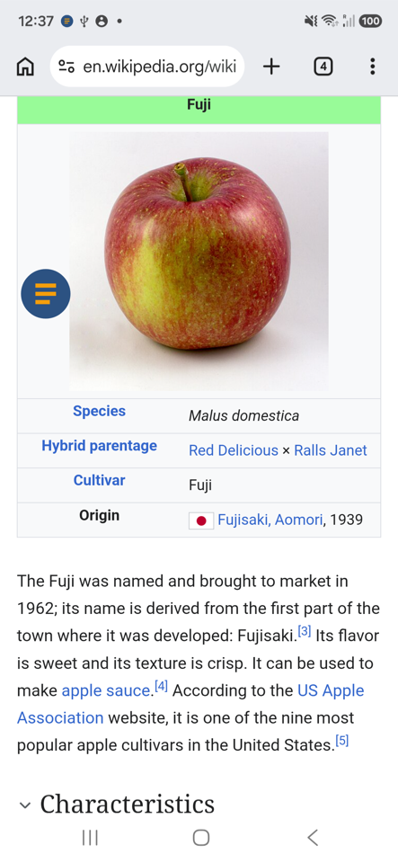
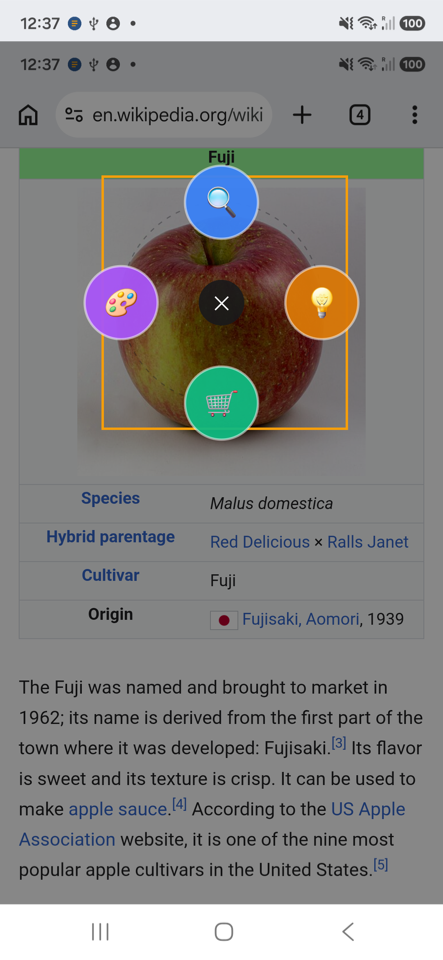
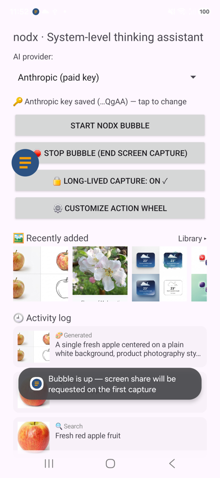

<div align="center">



<br/>

[](./LICENSE)
[](https://github.com/aistoume/nodx/releases)
[](https://chromewebstore.google.com/detail/ipljkbefemodjbihcnmmaallcfndmild)
[](https://aicon.solutions/nodx/)

**[Website](https://aicon.solutions/nodx/)** · **[Download desktop](https://github.com/aistoume/nodx/releases)** · **[Chrome extension](https://chromewebstore.google.com/detail/ipljkbefemodjbihcnmmaallcfndmild)** · **[Demo videos](https://www.youtube.com/playlist?list=PLLuJxzl3vakU)**

</div>

---

# nodx

> AI-assisted decision-thinking workspace. The user drives the depth; AI organises the result.

A local-first desktop app that helps managers turn fuzzy decision questions into structured, actionable thinking — plus a Chrome extension and an Android app that turn anything you *see* into AI action and feed it back into your thinking. Instead of one-shot chat, nodx walks you through:

1. **Survey** — AI proposes 5–7 candidate factors; you pick 3–5 (or type your own).
2. **First-principles decomposition** — selected factors expand into essence + sub-questions.
3. **Thinking document** — AI drafts a Google-Doc-style markdown deliverable. Editable in-place, with Mermaid diagrams and AI illustrations.
4. **Expert-panel debates** — 3–5 auto-cast experts (devil's advocate mandatory) argue your question over multiple rounds and converge on a Local Maximum with confidence and dissent conditions.
5. **A thinking library that compounds** — finished decisions are abstracted and indexed; new questions retrieve similar past cases and only debate the diff.

## 🎬 See it in action

| nodx Lens for Chrome — 40s tour | nodx Lens Android 1.0 |
|:---:|:---:|
| [](https://youtu.be/7nnm_P5aZ5k) | [](https://youtu.be/V-QNjle1uBk) |

<sub>More on the [Nodx playlist ▸](https://www.youtube.com/playlist?list=PLLuJxzl3vakU)</sub>

## The ecosystem

| App | What it does | Status |
|---|---|---|
| 🖥 [**nodx desktop**](./apps/desktop) | The thinking workspace: Survey → decomposition → document → expert panels → auto-recursion → case library | macOS release on the [Releases page](https://github.com/aistoume/nodx/releases) |
| 🌐 [**nodx Lens**](./apps/extension) | Chrome MV3 extension: select text or box any page region → customizable action wheel (explain / search / shop / generate / save) | [Chrome Web Store](https://chromewebstore.google.com/detail/ipljkbefemodjbihcnmmaallcfndmild) · v1.0 |
| 🤖 [**Lens for Android**](./apps/android) | Same action wheel, system-wide on your phone via a floating bubble | v1.0 — [Google Play (open testing)](https://play.google.com/store/apps/details?id=solutions.aicon.nodx) · [APK](https://aicon.solutions/nodx/lens/) |
| 🧲 [**Lens for Mac**](./apps/lens-mac) | ⌥+E select-to-explain anywhere on macOS | merged into nodx desktop |
| 🏠 [**Website**](./apps/web) | aicon.solutions — downloads, docs, pricing | live |

## 🎡 nodx Lens — the action wheel

Select text or box any region; the same four-spoke wheel appears. Every spoke — icon, name, colour, action, prompt, submenu — is editable, with a live preview.

| | |
|:---:|:---:|
|  <br/><sub>Box any region → the wheel appears</sub> |  <br/><sub>Boxes stay on the page as re-usable action hubs</sub> |
|  <br/><sub>Customize every spoke, live preview while you edit</sub> |  <br/><sub>The side panel remembers every capture and Q&A thread</sub> |

## 🤖 Lens for Android

<div align="center">

</div>

<table align="center"><tr>
<td></td>
<td></td>
<td></td>
<td></td>
</tr></table>

Floating bubble → box anything on screen → the same wheel: explain, search, shop, generate. Works system-wide via the accessibility screen-capture path (no per-session re-authorization).

## Status

Post-M1, mid-M2. Highlights:

- ✅ Tauri 2.11 desktop shell, SQLite with 14 migrations, in-proc Rust AI gateway (keychain-held keys, per-launch token)
- ✅ Survey → first-principles decomposition → thinking document → annotations (four-color, anchored)
- ✅ Expert-panel debate engine (multi-expert, devil's advocate, Local-Maximum convergence, merge/replace back into the doc)
- ✅ CBR thinking library: abstraction → embedding index → retrieve → fork-and-adapt; "debate only the diff" panels
- ✅ Auto-recursion engine: PM AI spawns sub-discussions until actionable, Auto-Run with per-layer preview + rollback
- ✅ Replay ("nothing gets lost"): recap cards, reasoning traces, open-question blockers across sessions
- ✅ React Flow network graph with material nodes, blank canvases, material synthesis, thinking/execution node splits
- ✅ Images in thinking: Mermaid diagrams, inspiration-pool images, AI-generated illustrations in the document
- ✅ Decision-report export + `.nodx` data bundles (full-fidelity subtree transfer)
- ✅ i18n (zh/en), ⌥+E system-wide capture, Windows CI
- ✅ **nodx Lens 1.0**: fully customizable wheel, 5 AI providers (Claude / GPT / Gemini / OpenRouter / local gateway), 13 search presets, quick model switcher
- ✅ **Android 1.0**: floating bubble, wheel, action log, 4 providers
- ⏳ Auto-recursion Sprint C, drafts drawer, @-mentions UI; Safari port in planning

Product spec and design docs are maintained in a private companion repo.

## Architecture

```
┌──────────────────────────────────────────────────────┐
│ apps/desktop  (Tauri 2.11 + React 19 + Vite 6)       │
│   ├─ TipTap editor (the document)                    │
│   ├─ Local SQLite via @tauri-apps/plugin-sql         │
│   └─ Calls AI through @nodx/ai → local in-proc Rust │
│      gateway on 127.0.0.1:8787 (keys in keychain)    │
└────────────────────┬─────────────────────────────────┘
                     │
        ┌────────────┴────────────┐
        ▼                         ▼
┌───────────────┐         ┌─────────────────────┐
│ packages/     │         │ workers/ai-gateway  │
│ - models      │         │ Cloudflare Worker   │
│ - ai          │ ◀──────▶│ (Bearer-token auth, │
│ (Zod schemas, │         │  SSE streaming,     │
│  prompts,     │         │  web_search tool)   │
│  client SDK)  │         │                     │
└───────────────┘         └─────────────────────┘
                                    │
                                    ▼
                           Anthropic Messages API
                           (Opus 4.8 / Haiku 4.5)
```

Workspaces:

| Path | Purpose |
|---|---|
| [`packages/models`](./packages/models) | Zod-typed domain entities — Topic / Message / Comment / Edge / DraftItem / TopicDocument |
| [`packages/ai`](./packages/ai) | Versioned prompt builders, output schemas, gateway client (`complete` / `completeText` / `pingGateway`) |
| [`apps/desktop`](./apps/desktop) | The Tauri/React app the user sees |
| [`apps/extension`](./apps/extension) | nodx Lens Chrome MV3 extension |
| [`apps/android`](./apps/android) | Lens for Android (Kotlin) |
| [`workers/ai-gateway`](./workers/ai-gateway) | The Cloudflare Worker that holds the Anthropic key and forwards prompts |

## Quick start

### Prerequisites

- Node 20+, pnpm 9+
- Rust toolchain (`rustup default stable`) — required by Tauri
- macOS Xcode CLT for Tauri (`xcode-select --install`)
- An Anthropic API key (core tier: Claude Opus 4.8; light tier: Haiku 4.5)

### 1. Install

```bash
git clone https://github.com/aistoume/nodx.git
cd nodx
pnpm install
```

### 2. Worker secrets

```bash
cp workers/ai-gateway/.dev.vars.example workers/ai-gateway/.dev.vars
# Edit and fill in real values:
#   ANTHROPIC_API_KEY=sk-ant-api03-...
#   CLIENT_TOKEN=$(openssl rand -hex 32)
```

`.dev.vars` is gitignored. Production secrets go via `pnpm --filter @nodx/ai-gateway exec wrangler secret put NAME`.

### 3. Desktop env

```bash
cp apps/desktop/.env.example apps/desktop/.env.local
# Edit and set:
#   VITE_AI_GATEWAY_URL=http://localhost:8787
#   VITE_AI_CLIENT_TOKEN=<same value as worker .dev.vars CLIENT_TOKEN>
```

### 4. Run

Two terminals:

```bash
# Terminal A — AI gateway (wrangler dev on :8787)
pnpm --filter @nodx/ai-gateway dev

# Terminal B — Tauri desktop app
pnpm desktop:dev
```

First Tauri build takes a few minutes (Rust compilation); subsequent runs are fast.

### 5. Verify the gateway

```bash
curl http://localhost:8787/health
# {"ok":true,"service":"nodx-ai-gateway"}

TOKEN=<your CLIENT_TOKEN>
curl -X POST http://localhost:8787/v1/complete \
  -H "authorization: Bearer $TOKEN" \
  -H "content-type: application/json" \
  -d '{"model":"claude-haiku-4-5","prompt":"reply with JSON {\"hi\":\"world\"}","max_tokens":100}'
```

If you get a `text` field back, the path is healthy.

## Development

```bash
pnpm -r typecheck     # all packages
pnpm -r test          # 107 vitest cases
pnpm desktop tauri build   # produce a release .app / .dmg
```

Tauri-side checks:

```bash
cd apps/desktop/src-tauri && cargo check
```

## Tech choices

| Concern | Pick | Why |
|---|---|---|
| Desktop shell | Tauri 2.11 | smaller / safer than Electron; Rust security model |
| UI framework | React 19.2 + Vite 6 | latest stable, ref-as-prop, async transitions |
| Styling | Tailwind v4 (Oxide) | CSS-native `@theme`, no JS config, fast builds |
| Editor | TipTap 2 + ProseMirror | richest collab story for v3 (Yjs integration) |
| Local DB | SQLite via Tauri SQL plugin | offline-first, foreign keys, triggers |
| AI gateway | Cloudflare Workers / in-proc Rust | edge-deploy or fully local, SSE streaming |
| AI providers | Claude (Opus 4.8 core, Haiku 4.5 light) + Gemini (embeddings, image gen) | structured reasoning + cheap hot-path |
| Sync (future) | Yjs over WebSocket → Supabase Realtime | CRDT, mature React story |

Full rationale in the private product spec.

## Project layout

```
nodx/
├── apps/
│   ├── desktop/           # Tauri 2.11 + React 19 — the thinking workspace
│   │   ├── src/           #   TipTap doc, Survey card, panels, network graph
│   │   └── src-tauri/     #   Rust backend, SQLite migrations, in-proc AI gateway
│   ├── extension/         # nodx Lens — Chrome MV3 extension
│   ├── android/           # Lens for Android (Kotlin, floating bubble + wheel)
│   ├── lens-mac/          # ⌥+E select-to-explain (merged into desktop)
│   └── web/               # aicon.solutions static site
├── packages/
│   ├── models/            # Zod schemas
│   └── ai/                # Prompt templates + gateway client
├── workers/
│   └── ai-gateway/        # Cloudflare Worker (Anthropic forwarder)
└── prototype.html         # M0 design prototype (D3-based)
```

## License

Copyright 2026 Aicon Solutions (aistoume).

Licensed under the [Apache License, Version 2.0](./LICENSE). You may use,
modify, and distribute this code — including commercially — provided you
preserve the license and notices. "nodx" and "Aicon Solutions" names and
logos are not licensed for use as trademarks.
